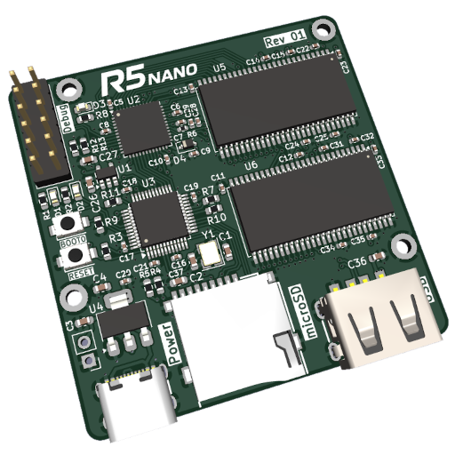

# R5 nano

Single board computer with future Linux support, mostly intended for use as a lightweight server.

Planned SoC implementation using LiteX featuring a RISC-V CPU and 64MiB RAM.

## Gateware

TODO

## Software

Work in progress.

Firmware supports bitstream upload over USB to the FPGA at the moment.

## Hardware

* iCE40UP5k FPGA, 5280 LUTs
* 64MiB SD-RAM
* microSD card for storage
* USB port for connectivity like ethernet
* USB-C port for power, bitstream upload
* STM32F103 for initial bitstream load from either USB-C or microSD
* Debug header with FPGA+STM32 GPIO, SWD for STM32
* 52x52mm (~2x2in) board

